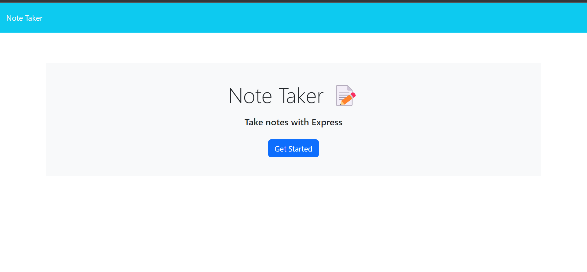
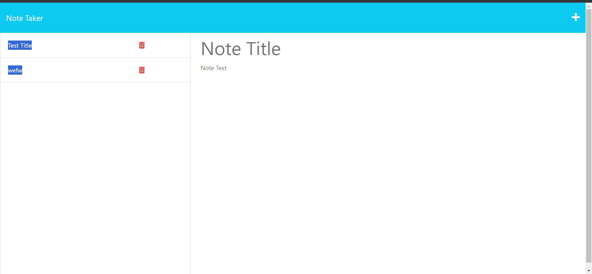
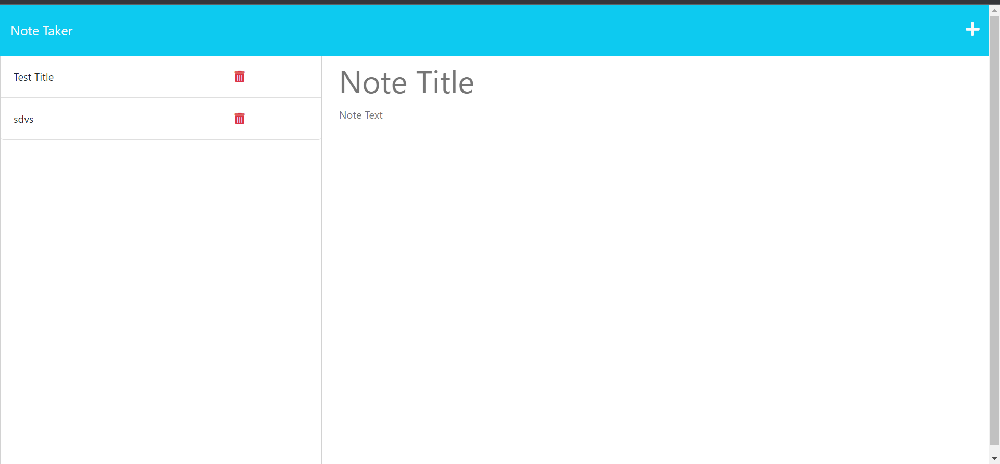

# Note Taker Express

The **Note Taker Express** application is a user-friendly web application designed to help small business owners organize their thoughts and keep track of tasks effectively. With an intuitive interface, this application allows users to create, save, and manage notes effortlessly.

## Features

- **Create New Notes:** Users can create new notes by entering a title and the note's text in the provided fields.

- **Save and Organize:** Notes can be saved, and they appear in the left-hand column alongside existing notes, keeping everything neatly organized.

- **Edit and View:** Users can click on existing notes in the list to view or edit them, providing easy access to important information.

- **Clear Form:** Users can clear the note entry fields at any time using the "Clear Form" button, ensuring a clean slate for new notes.

## Getting Started

To use the Note Taker Application, follow these steps:

1. **Clone the Repository:**
   ```
   git clone https://github.com/XenodiusAlpha/note_Taker_Express.git
   ```

2. **Navigate to the Project Directory:**
   ```
   cd note_Taker_Express
   ```

3. **Install Dependencies:**
   ```
   npm install
   ```

4. **Start the Application:**
   ```
   npm start
   ```

   The application will be accessible at `http://localhost:3001`.

## Usage

1. **Open the Application:**
   - When you open the Note Taker Express application, you will be presented with a landing page featuring a link to the notes page.

2. **Create a New Note:**
   - Click on the link to the notes page.
   - On the notes page, enter a new note title and the note’s text in the provided fields.
   - Once entered, a "Save Note" button will appear in the navigation at the top of the page.

3. **Save the Note:**
   - Click on the "Save Note" button to save the new note. The note will appear in the left-hand column with existing notes, and the navigation buttons will disappear.

4. **Edit an Existing Note:**
   - Click on an existing note in the list in the left-hand column to view or edit it in the right-hand column.

5. **Create Another New Note:**
   - To create another new note, click on the "New Note" button in the navigation. Empty fields will be presented in the right-hand column, and the button will disappear.

## Technologies Used

- HTML5
- CSS3
- JavaScript
- Node.js
- Express.js

## Contributing

Contributions are welcome! If you find any issues or have suggestions for improvement, please create an issue or a pull request in this repository.

## License

This project is licensed under the MIT License - see the [LICENSE](LICENSE) file for details.

## Screenshots







## Deployment

Heroku:

https://justin-note-taker-express-d2e39e4fa93c.herokuapp.com/